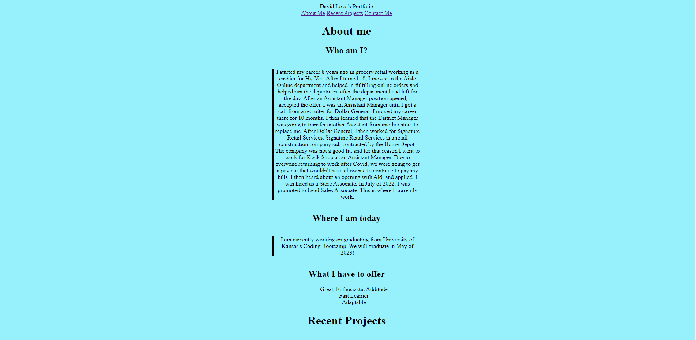

# Description
This is a portfolio page for David Love
# What was the motivation?
I wanted to create a website where potential employers could view my history, work, and contact info
# What problem does it solve?
It solves the problem of companies not having any resources to use to find information about me
# What did I learn?
I leared how to use CSS to style websites and how to add captions to pictures
# Screenshot

# Website URL
https://cyril1743.github.io/all-about-me/